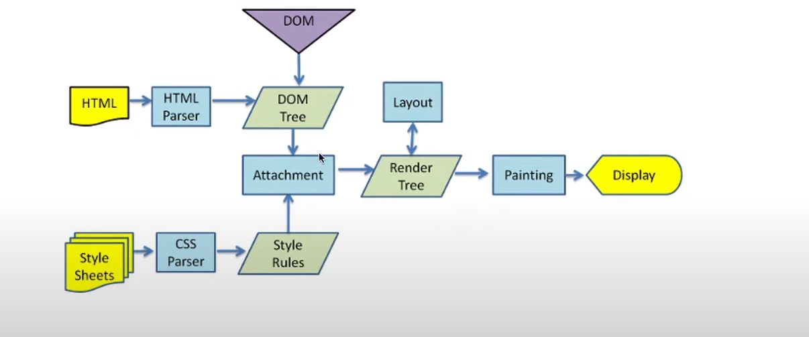

### 浏览器内核
+ Gecko
+ Trident
+ Webkit
+ Blink

实际上，我们常说的浏览器内核指的是浏览器的排版引擎：
+ 排版引擎（layout engine），也称为浏览器引擎（browser engine）、页面渲染引擎（rendering engine）或样板引擎

### 浏览器渲染过程
+ Html解析的时候遇到javascript标签，应该怎么办？  
   + 会停止解析html,而去加载和执行javascript代码；  
     

+ javascript代码由谁来执行：javascript引擎
+ V8引擎  
  
